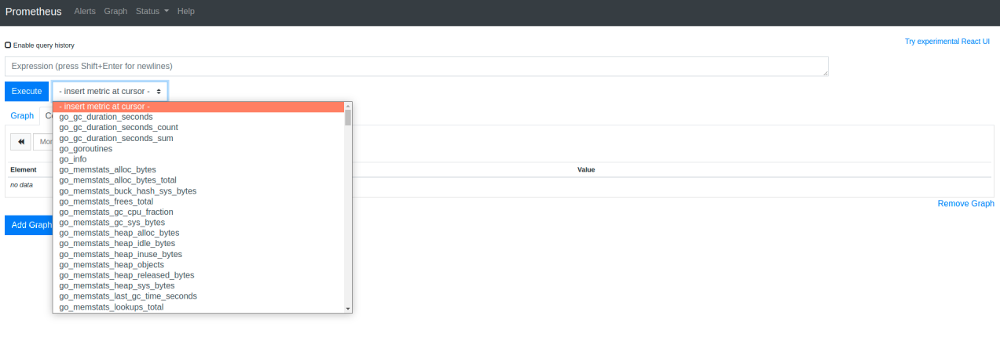
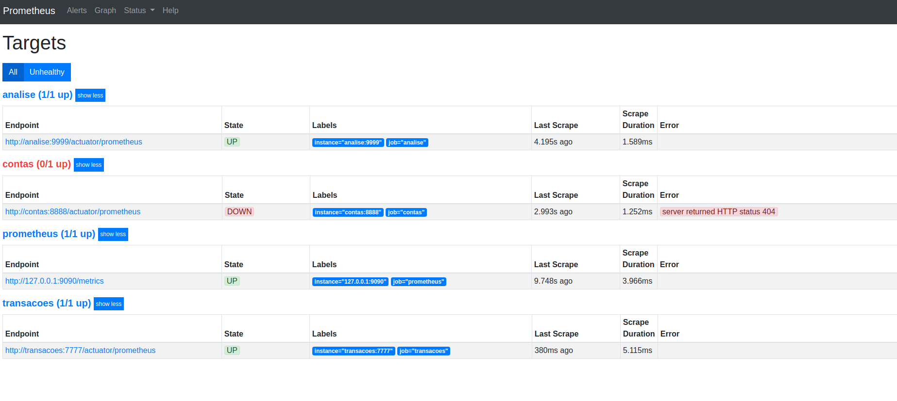

# Acessando Prometheus pela primeira vez!!!!

O Prometheus é uma ferramenta bastante importante em um ambiente de aplicações distribuídas, ele nos
ajuda à realizar a coleta de métricas dos nossos serviços de uma maneira bastante aderente aos 
padrões de computação na nuvem.

Para nosso uso vamos _"subir"_ uma instância para que ele possa coletar nossas métricas. Vale a pena notar
que estamos rodando em ambiente de desenvolvimento, quando estamos em ambiente produtivo precisamos de provavelmente
mais de uma instância para garantir alta disponibilidade e resiliência. Isso é muito importante!!!!

Se você usou nosso [docker compose](../ops/docker-compose.yaml) você poderá verificar
que temos um elemento chamado **prometheus**. Abaixo segue o fragmento

```yaml
    ##
    ## restante omitido
    ##
  prometheus:
    image: prom/prometheus
    volumes:
      - ./prometheus.yml:/etc/prometheus/prometheus.yml
      - prometheus-volume:/etc/prometheus/
    ports:
      - 9090:9090
    ##
    ## restante omitido
    ##
```

Temos algumas configurações de volumes que serão utilizadas para configuração
da ferramenta, mas não é importante para esse momento.

Neste momento atente-se à porta que está mapeada para [localhost:9090](http://localhost:9090/) então vamos nos conectar
na aplicação!!!

Poderemos ver que a tela do prometheus ś bastante _"pobrezinha"_, não vamos encontrar muitas opções, afinal esta é uma ferramenta
para monitoramento.

Você deve ser apresentado à seguinte tela



Temos alguns menus na barra que são muito importante para checarmos as configurações do prometheus, as configurações relacionados ao 
sistema estão no menu **Status**, uma parte importante legal é que o prometheus também conta com um sistema de alertas que pode ser instaldo
junto a solução, as configurações de alertas estão no menu **Alertas**, atente-se que o módulo deve estar instalado.

Outra parte importante na parte central da tela, é o combo para seleção das métricas, neste combo **todas** as métricas que os sistemas conectados
ao prometheus estão listadas, perceba que precisamos trabalhar com bastante rigor nas nomenclaturas das métricas.

## Explorando o menu Status

O menu Status é um menu que conta com diversos sub-menus relacionados a configuração do prometheus, podemos encontrar a versão do sistema, 
configurações de runtime, os parâmetros de inicialização da ferramentas entre outras informações.

Os pontos bastante importante relacionados à coleta de métricas são **Targets** e **Service Discovery**, estes são relacionados à como o prometheus está operando
em relação a obtenção dos valores da métricas. 

Vamos entender isso agora!!!!

### Targets

**Targets** são "alvos", no nosso contexto são os nossos sistemas que estão configurados para que o prometheus faça a coleta das métricas. Essas
configurações são realizadas através do arquivo de configuração _prometheus.yaml_, mas este pode ser um trabalho de infra, para nosso contexto basta
entendermos que precisamos avisar o prometheus que ele precisa buscar métricas.

Essa tela nos ajuda bastante a entender como estão nossos sistemas em relação as coletas, ela mostra se o endpoint de coleta está ok, e podemos
ver informações da última coleta e quanto tempo demorou. Quando há erro também conseguimos identificar o motivo.

Então esta tela nos ajuda muito, vale a pena lembrar dela....algum momento ela pode te salvar!!!

Vamos dar uma olhada nela.



Olha que legal, com um simples olhar já podemos perceber que nosso sistema de contas está com problema, olhe o campo State está marcado
como **DOWN**, neste caso precisaríamos dar uma olhada nele.

Também temos algumas informações sobre atributos do sistema também como endpoint de coleta e IPs por exemplo 

### Service Discovery


# Informações de suporte

* Quer saber mais sobre Prometheus? Acesse o [link!](https://prometheus.io/)
* Se você quer consultar um guia para entender os principais elementos da ferramenta, [esse link pode te ajudar com esta tarefa](https://prometheus.io/docs/prometheus/latest/getting_started/)
* Talvez você possa ter achado essa documentação um pouco complexa, se você achou isso [esse outro conteúdo pode te ajudar
    com uma visão um pouco mais simplificada](prometheus.md)
* Você pode estar se perguntando "O que é um volume no docker??". [Esse link pode te ajudar em descobrir isso](https://docs.docker.com/storage/volumes/)
* Se por algum motivo, você se questionou sobre o mapeamento de portas no docker [esse link pode te ajudar em entender isso em detalhes](https://docs.docker.com/config/containers/container-networking/)
* Se por acaso você se perguntou "Mas pera ae se nomenclatura de métricas pode ser um problema, será que existe uma padrão para isso???. [Neste link você vai encontrar um pouco disso](https://prometheus.io/docs/practices/naming/)


    
