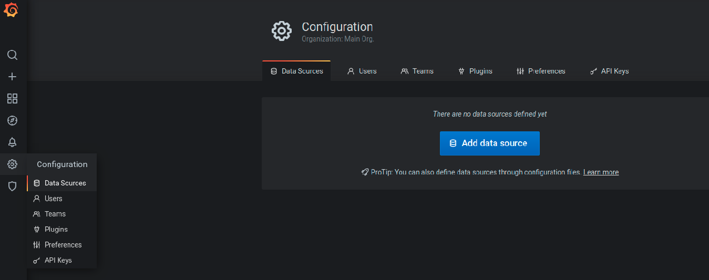
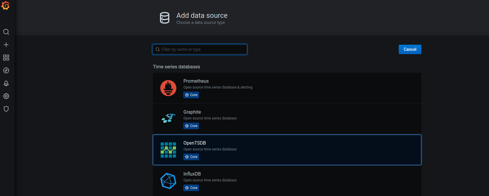
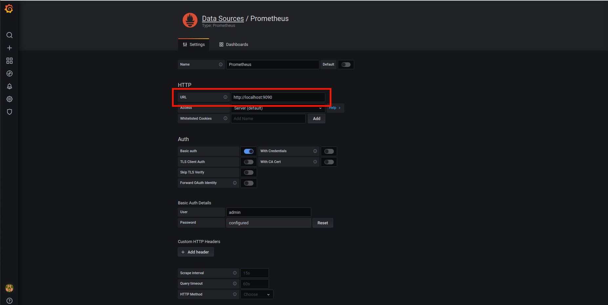

# Configurando nossa fonte de dados no Grafana!

O Grafana é uma ferramenta para criação e visualização de gŕaficos, ele não
gerencia nenhum tipo de dados relacionado a métricas. Esses dados devem
ser consultados em alguma fonte de dados, o grafana dá suporte há uma
série de ferramentas que possuem dados dos mais diversos tipos.

Podemos configurar como fonte de dados uma fonte de ElasticSearch onde temos dados
de aplicações, ou também podemos consultar dados de um Jaeger que são relacionados à
Trace Distribuído. Mas para nosso caso de uso vamos utilizar o Prometheus como fonte de
dados, no nosso Prometheus constam todos métricas que reportamos através de nossas aplicações.

Então vamos ao menu de configuração de Data Sources, menu localizado no canto superior esquerdo.

Se você não encontrou, sem problemas a imagem abaixo pode te ajudar!!!



Nesta tela temos um botão azul, em que podemos iniciar o procedimento de configurar nosso Datasource, então
não vamos perder tempo e ir clicar ele!

Depois desse passo você será apresentado à próxima tela onde devemos escolher o tipo de
Datasource que queremos configurar, no nosso caso vamos escolher configurar um Prometheus, então clique nele!

Vamos dar uma olhadinha nesta tela:



Estamos indo bem!

No nosso próximo passo precisamos inserir configurações relacionadas ao 
**Prometheus**, como por exemplo localização dele na rede, modelos de autenticação, tempos de scrape e mais algumas
configurações que dependendo do seu caso de uso possa fazer sentido.

Para nosso propósito, não incluímos nenhum modelo de segurança afinal estamos
rodando em ambiente de desenvolvimento local.

**Nota importante**

Lembre-se, todos os outros ambientes devem possuir no mínimo autenticação por senha, e proteção via rede, nunca exponha 
suas métricas de maneira pública, elas podem conter informações relevantes para o negócio, bem como informações preciosas 
para possíveis ataques.

Então vamos configurar nosso **Prometheus**!

Como podemos observar na tela abaixo colocamos o endereço **http://prometheus:9090** na configuração, mas porque este endereço?



Lembre que estamos usando nosso `docker-compose` como base das informações e serviços
declarados no mesmo yaml de docker-compose podem ser chamados por hostname, olha que massa!

Docker facilitando nossa vida...

Vamos ver o trecho do nosso [docker compose](../ops/docker-compose.yaml) que nos mostra essa configuração
 
```yaml
    ##
    ## restante omitido
    ##
   prometheus:
     image: prom/prometheus
     volumes:
       - ./prometheus.yml:/etc/prometheus/prometheus.yml
       - prometheus-volume:/etc/prometheus/
     ports:
       - 9090:9090
    ##
    ## restante omitido
    ##
```

Perceba que o nome do serviço automaticamente faz com que ele torne uma entrada de hostname na nossa rede interna
do docker-compose.yaml. Simples!

Depois de inserir as informações podemos testar nossas configurações, então clique em **Save & Test**. Se tudo ocorreu
bem você deve ter recebido a seguinte mensagem "Datasource is working", isso indica sucesso!

**Grafana** e **Prometheus** conectados agora podemos criar nossos próprios gráfico _"bacanudos"_, vamos explorar algumas 
funcionalidades do grafana, agora você tem duas opções:

* Criar um gráfico manualmente
* Importar um pré-configurado que consegue ler configurações padrão de aplicações Spring Boot. [Aqui tem uma detalhamento completo
de como você pode fazer isso!](importando_graficos_grafana.md)

# Informações de suporte

* Se você não tem idéia do que é o Grafana! Não se preocupe! [Aqui você pode encontrar uma boa definição!](https://grafana.com/) 