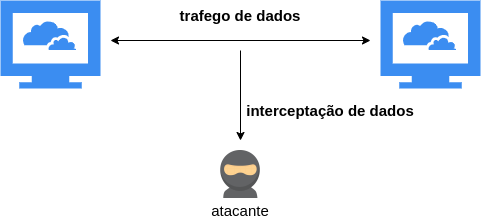
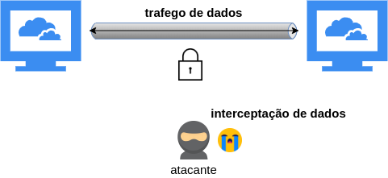

# Quando devo encriptar dados em trânsito? Qual é a motivação?

Nossas aplicações nunca vivem sozinhas, sempre precisamos realizar chamadas para outras aplicações para
concluir uma determinada tarefa ou para persistir nossas informações no banco de dados.

Essas aplicações se comunicam via rede, ou seja, há uma transmissão de dados entre as aplicações.

Imagine o seguinte contexto, algum agente mal-intencionado consegue interceptar a comunicação e "roubar"
os dados que estão passando por esse canal. Não parece ser viável estar sujeito esse tipo de situação.

Vamos ver um exemplo:

Para nos proteger desses ataques **sempre** precisamos usar um canal de comunicação seguro, um modelo
que nos permita nos autenticar e realizar a encriptação da mensagem antes do envio. Neste caso quando o 
atacante obter acesso às informações essas informações vão estar criptografadas de maneira que a informação
não tenha serventia ao atacante.

Vamos ver um exemplo:

Perceba que o canal de transmissão está protegido, o acesso a informação fica muito
mais complexo para o atacante, isso exige muito mais esforço e minimiza consideravelmente
as chances de termos informações expostas.