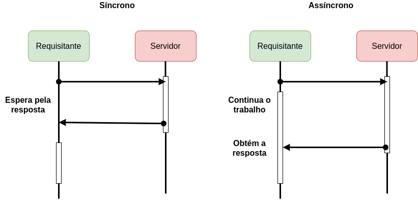

# Qual diferença entre síncrono e assíncrono?

No desenvolvimento de software é bastante comum a gente ouvir os termos síncrono e assíncrono, mas qual é a diferença 
entre eles?

Quando falamos de síncrono, estamos falando de um fluxo onde esperamos o término do mesmo, como por exemplo:

Estou consumindo uma API de criação de uma loja e essa API é síncrona, ao enviar a requisição será executados todos os 
passos a seguir até o retorno:

1º Requisição chega no Servidor

2º Servidor processa a requisição

3º Servidor processa as regras de negócio

4º Servidor salva no banco de dados a nova loja cadastradas

5º Servidor responde a requisição

Em todos esses passos o requisitante ficou aguardando os mesmos a serem executados sequencialmente, ou seja, sincronamente!

Quando falamos de assíncrono, estamos falando em não aguardar os passos a serem executados, pois eles estão sendo 
executados em `segundo plano`!

Como assim, em `segundo plano`!?

Vamos lá, para o mesmo exemplo!

1º Requisição chega no Servidor

2º Servidor responde a requisição

3º Servidor processa a requisição

4º Servidor processa as regras de negócio

5º Servidor salva no banco de dados a nova loja cadastradas

Nesse exemplo após receber a chamada o servidor já respondeu e em paralelo iniciou o processamento do cadastro da nova 
loja, demais né!?

Se ainda está confuso, não se preocupe, uma imagem vale mais que mil palavras!

Ainda está confuso, o que acha de um exemplo do mundo real?

Vamos lá!

Imagina que você joga videogame e chega um momento que você está com fome de pizza!

No processo síncrono, você tem que parar de jogar, ir na pizzaria, aguardar a pizza ficar pronta, comer e depois voltar 
a jogar!

No processo assíncrono, você pede uma pizza por telefone, volta a jogar e somente quando a pizza chegar você para de jogar!

Demais né!?

Voltando para nosso Bootcamp, quando falamos de `segundo plano`, estamos falando de processar assíncronamente e 
existem várias formas de processar em `segundo plano', como por exemplo:

- Executar uma operação assíncronamente de tempos em tempos, ou seja, agendada!
- Executar uma operação assíncronamente quando requisitada via API, Mensagem, etc.

Demais né!

## Dicas de Luram Archanjo

Geralmente em sistemas legados é utilizado muito o `polling` que é uma técnica de ficar em tempos em 
tempos executando uma operação, como por exemplo:

Imagina que preciso enviar email assíncronamente, porém o sistema legado salva os emails a serem enviados na base de 
dados, portanto eu preciso agendar uma `tarefa` que será executada a cada um minuto, para verificar se tem email a ser 
enviado na base de dados.

Hoje temos outras formas de fazer isso, porém não temos o histórico do porque tomaram essa decisão o bom é que sabemos 
como lidar!