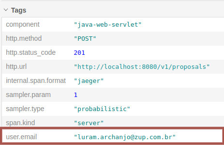
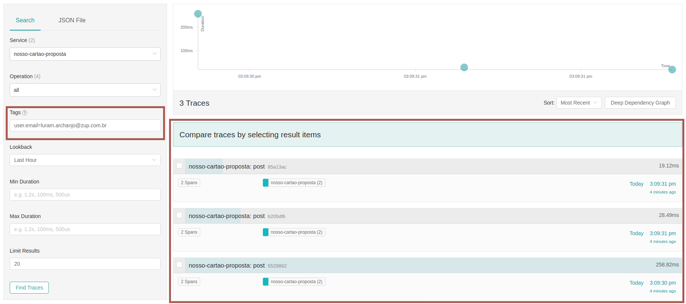

# Jaeger - Tags

Sabemos que no OpenTracing existe o conceito de Span, que é um período que representa uma operação, como por exemplo, 
uma requisição HTTP, na qual contém metadados extremamente importantes, como as **Tags**, que tem como objetivo carregar 
informações importantes do Span, como por exemplo:

- component
- http.method
- http.status_code
- http.url

Essas informações são importantes para o troubleshooting de problemas e graças ao Spring elas são reportadas automaticamente!

Caso deseje reportar uma TAG específica, como por exemplo, email do usuário, precisaremos instrumentar no código!

Vamos fazer isso?

O Spring provê uma classe denominada [Tracer](https://github.com/opentracing/opentracing-java/blob/master/opentracing-api/src/main/java/io/opentracing/Tracer.java) 
na qual você consegue fazer operações relacionadas ao OpenTracing!

1º Precisamos injetar o objeto Tracer, conforme código abaixo:

```java
public class PropostaController {

  private final Tracer tracer;

  public PropostaController(Tracer tracer) {
    this.tracer = tracer;
  }

}
```

2º Agora que temos o objeto, precisamos pegar o `span` ativo, conforme código abaixo:

```java
Span activeSpan = tracer.activeSpan();
```

3º Precisamos definir as tags desejadas, para isso o objetivo Span tem o método `setTag`, conforme código abaixo:

```java
activeSpan.setTag("user.email", "luram.archanjo@zup.com.br");
```

Demais né! Vamos testar?

Para testar precisamos verificar se o Jaeger foi iniciado, conforme está no docker-compose, para isto, vamos abrir em 
nosso navegador favorito o endereço `http://localhost:16686/search`

Agora precisamos iniciar nossa aplicação e fazer algumas operações, como por exemplo, criar uma proposta!

Após fazer vários operações, entre no trace da operação que está o código e verifique se a tag consta, conforme imagem 
abaixo:



Demais né! Agora podemos utilizar várias tags para melhorar nosso processo de troubleshooting, como por exemplo, filtrar 
por todas as operações que o `luram.archanjo@zup.com.br` fez, conforme imagem abaixo:



# Dicas de Luram Archanjo

Use com parcimônia as tags, pois é um código de infraestrutura (trace) em conjunto com o código de negócio, portanto 
tente segmentar!

# Informações de suporte

Gostaria de saber mais sobre a Jaeger? [Aqui tem uma explicação do que entendemos que você deve considerar!](https://www.jaegertracing.io/docs/1.18/#about)