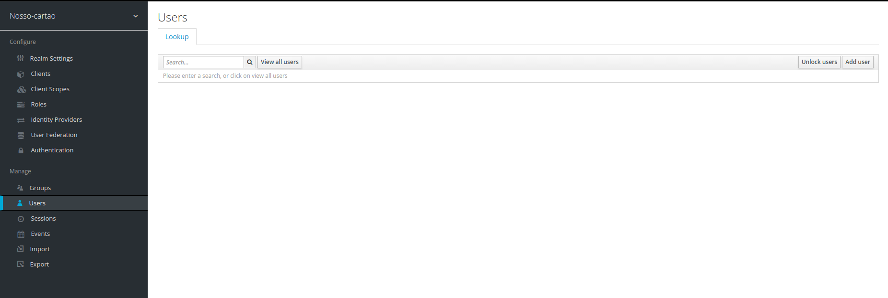
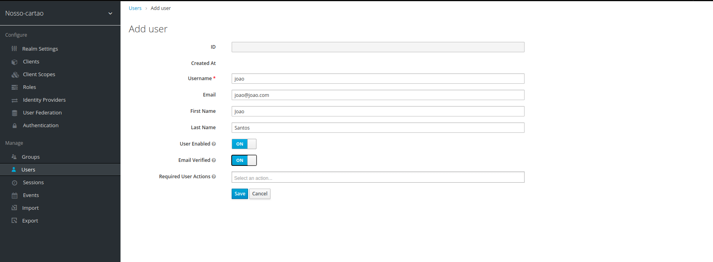

# Criando um usuário no Keycloak

Como já vimos anteriormente o Keycloak é uma ferramenta que permite que possamos gerenciar nossos usuários,
desta maneira garantimos que as informações do usuário esteja segura, visto que está é uma das responsabilidades
de um IAM.

Então é hora de criar nosso primeiro usuário na plataforma, vamos identificar o keycloak na nossa infraestrutura local

Se você usou nosso [docker-compose.yaml](../ops/docker-compose.yaml) você poderá verificar
que temos um elemento chamado **keycloak**. Abaixo segue o fragmento

```yaml
  keycloak:
    image: jboss/keycloak
    ports:
      - 18443:8443
      - 18080:8080
      - 19990:9990
    depends_on:
    ##
    ## restante omitido
    ##
    environment:
    ##
    ## restante omitido
    ##
``` 
A porta de administração padrão do keycloak é **8080**, mas perceba que fizemos um "bind" para
porta **18080**.

Faça o login na plataforma, caso você tenha algum problema em realizar o login [este link pode te ajudar](../informacao_procedural/login-keycloak.md)

Depois disso você deve certificar-se que você esteja no seu Realm previamente criado. Se por algum motivo você não criou seu Realm, sem problemas
[este link vai te ajudar com isso](../informacao_procedural/realm_keycloak.md)

No canto superior esquerdo você pode ver o Realm selecionado, na figura abaixo estamos no Nosso-cartao, no menu **Manage** seleciona a opção
**Users** e então clique no botão **Add User**. Como na figura abaixo:



Depois você será redirecionado para uma página onde você deverá preencher informações do usuário, como na figura abaixo



No próximo passo você vai precisar informar a senha do usuário que estamos cadastrando, depois disso você vai clicar no botão
**Set Password**


## Resultado Esperado
* Novo usuário cadastrado com sucesso

## Informações de suporte
 
