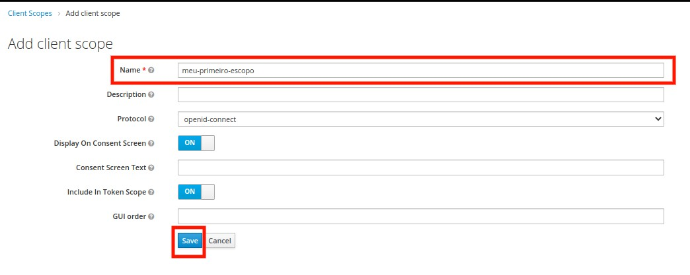

# Criando escopos no Keycloak

Como já vimos anteriormente o Keycloak é uma ferramenta que permite que possamos gerenciar nossas aplicações (clientes),
desta maneira garantimos essas aplicações, como browser, aplicativos e serviços estejam configuradas e seguras. 

Essas aplicações podem ter inúmeros escopos, que são utilizados para permitir, habilidar, bloquear determinadas ações no 
sistema, como por exemplo: Somente quem tem o escopo ADMIM pode ver X,Y,Z página.

Vamos criar nosso primeiro escopo e associar a um cliente?

> Está em dúvida sobre o que é um Cliente e como criar? Não se preocupe! [Escrevemos esse material para você!](keycloak-client.md)

Se você usou nosso [docker-compose.yaml](../ops/docker-compose.yaml) você poderá verificar
que temos um elemento chamado **keycloak**. Abaixo segue o fragmento

```yaml
  keycloak:
    image: jboss/keycloak
    ports:
      - 18443:8443
      - 18080:8080
      - 19990:9990
    depends_on:
    ##
    ## restante omitido
    ##
    environment:
    ##
    ## restante omitido
    ##
``` 
A porta de administração padrão do keycloak é **8080**, mas perceba que fizemos um "bind" para
porta **18080**.

Faça o login na plataforma, caso você tenha algum problema em realizar o login [este link pode te ajudar](keycloak-login.md)

Depois disso você deve certificar-se que você esteja no seu Realm previamente criado. Se por algum motivo você não criou seu Realm, sem problemas
[este link vai te ajudar com isso](keycloak-realm.md)

No canto superior esquerdo você pode ver o Realm selecionado, na figura abaixo estamos no Nosso-cartao, no menu **Configure** 
seleciona a opção **Client Scopes** e então clique no botão **Create**. Como na figura abaixo:


Depois você será redirecionado para uma página onde você deverá preencher informações do escopo, como na figura abaixo



Eba! Você criou seu primeiro cliente! Vamos associar em nossa aplicação?

Para associar o escopo criado em nossa aplicação, no menu **Configure**  seleciona a opção **Clients** e então clique 
no botão **Edit** do cliente desejado. Como na figura abaixo:


Depois você será redirecionado para a página de modificação do seu cliente, clique na aba **Client Scopes**, nela terá 
duas opções **Default Client Scopes** que são os escopos padrões que a aplicação irá ter e **Optional Client Scopes** que 
são os escopos opcionais que sua aplicação poderá prover!

Encontre e selecione o escopo criado na seção **Default Client Scopes** e clique em **Add selected**, conforme imagem 
abaixo:


Eba! Está tudo configurado! Para testar gera uma novo token e verifica se o escopo criado está contido no mesmo, conforme 
exemplo abaixo:

**Requisiçao**

```shell script
$ curl --location --request POST 'http://localhost:18080/auth/realms/nosso-cartao/protocol/openid-connect/token' \
--header 'Content-Type: application/x-www-form-urlencoded' \
--data-urlencode 'grant_type=client_credentials' \
--data-urlencode 'client_id=nosso-cartao-client' \
--data-urlencode 'client_secret=1610ed88-3a65-45ab-950a-c856f9ee17d2'
```

**Token**

```json
{
    "access_token": "eyJhbGciOiJSUzI1NiIsInR5cCIgOiAiSldUIiwia2lkIiA6ICJMV2Zic1hycUJINHBTM2JVTWN4TzRaRnpxYjBFRnBrdjZ5RXhUY2NMb1pnIn0.eyJleHAiOjE2MDA0NDAyMjcsImlhdCI6MTYwMDQzOTkyNywianRpIjoiZjAzZGM4YmQtZmI4Zi00NDQ5LWIyZGQtZWYwZThmODhmNWQ1IiwiaXNzIjoiaHR0cDovL2xvY2FsaG9zdDoxODA4MC9hdXRoL3JlYWxtcy9ub3Nzby1jYXJ0YW8iLCJhdWQiOiJhY2NvdW50Iiwic3ViIjoiNTFmNGQzY2YtZGU4Yi00NDllLWFmZWUtNDdiNTQ1MzU0NmU1IiwidHlwIjoiQmVhcmVyIiwiYXpwIjoibm9zc28tY2FydGFvLWNsaWVudCIsInNlc3Npb25fc3RhdGUiOiIzNWE5ZDUwOS0xMzkzLTQyY2ItYjc2Ny05ZmFmYmU1NmU3NjYiLCJhY3IiOiIxIiwicmVhbG1fYWNjZXNzIjp7InJvbGVzIjpbIm9mZmxpbmVfYWNjZXNzIiwidW1hX2F1dGhvcml6YXRpb24iXX0sInJlc291cmNlX2FjY2VzcyI6eyJhY2NvdW50Ijp7InJvbGVzIjpbIm1hbmFnZS1hY2NvdW50IiwibWFuYWdlLWFjY291bnQtbGlua3MiLCJ2aWV3LXByb2ZpbGUiXX19LCJzY29wZSI6Im1ldS1wcmltZWlyby1lc2NvcG8gcHJvZmlsZSBlbWFpbCIsImNsaWVudElkIjoibm9zc28tY2FydGFvLWNsaWVudCIsImVtYWlsX3ZlcmlmaWVkIjpmYWxzZSwiY2xpZW50SG9zdCI6IjE3Mi4xNy4wLjEiLCJwcmVmZXJyZWRfdXNlcm5hbWUiOiJzZXJ2aWNlLWFjY291bnQtbm9zc28tY2FydGFvLWNsaWVudCIsImNsaWVudEFkZHJlc3MiOiIxNzIuMTcuMC4xIn0.Gkqumkq5N_mH1L40695yzPk0b9Zbu-GdjUh5LtZudtAb6LSgPjLNTU5thQYgGdq6PvEfWaSpCDi75ewbkb5SlNLOMlXa4NlrSjBjLMBowStugKDm7UaYLUcf4Cjf-I5_Vx5AmsSQuhT2LfaefUe6x0RKJPEruGQdeZGXqW7F0i-gbhXSYxB5MKFeX_6rZBfmE9Ch3j4TlkCvze7EITc-Q-roLaDtFI654SHvOLv7bpf07kec0REzsMs7oAwpJ3i4VzPhsXKK52EQUpwdBrrd0p4pk9JeM1l0lIc13c1N64-y7BlgKqkynWWJMEPC8nOqNNDLUbP5EaQWq4d4kw9hng",
    "expires_in": 300,
    "refresh_expires_in": 1800,
    "refresh_token": "eyJhbGciOiJIUzI1NiIsInR5cCIgOiAiSldUIiwia2lkIiA6ICI2Mjg0OTFhOC0xNTRiLTQ2MDItYWJmYi0wYThhNWE1Njk0ZDgifQ.eyJleHAiOjE2MDA0NDE3MjcsImlhdCI6MTYwMDQzOTkyNywianRpIjoiOGNhMmU5MjMtYjJiYi00MDBiLWJkNTUtODAzNDkyNmI4YTlmIiwiaXNzIjoiaHR0cDovL2xvY2FsaG9zdDoxODA4MC9hdXRoL3JlYWxtcy9ub3Nzby1jYXJ0YW8iLCJhdWQiOiJodHRwOi8vbG9jYWxob3N0OjE4MDgwL2F1dGgvcmVhbG1zL25vc3NvLWNhcnRhbyIsInN1YiI6IjUxZjRkM2NmLWRlOGItNDQ5ZS1hZmVlLTQ3YjU0NTM1NDZlNSIsInR5cCI6IlJlZnJlc2giLCJhenAiOiJub3Nzby1jYXJ0YW8tY2xpZW50Iiwic2Vzc2lvbl9zdGF0ZSI6IjM1YTlkNTA5LTEzOTMtNDJjYi1iNzY3LTlmYWZiZTU2ZTc2NiIsInNjb3BlIjoibWV1LXByaW1laXJvLWVzY29wbyBwcm9maWxlIGVtYWlsIn0.ZkZXg2QFF6APBqzn4G7F1D99f1MU9wZdeu_zcebDHhE",
    "token_type": "bearer",
    "not-before-policy": 0,
    "session_state": "35a9d509-1393-42cb-b767-9fafbe56e766",
    "scope": "meu-primeiro-escopo profile email"
}
```

Demais né!?

## Informações de suporte

* Talvez você pode estar se perguntando, qual a função sobre o docker-compose. [Aqui você pode encontrar](https://docs.docker.com/compose/)
