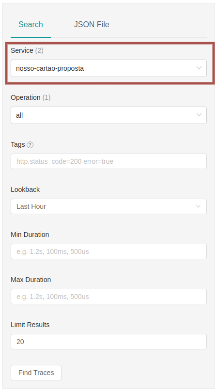
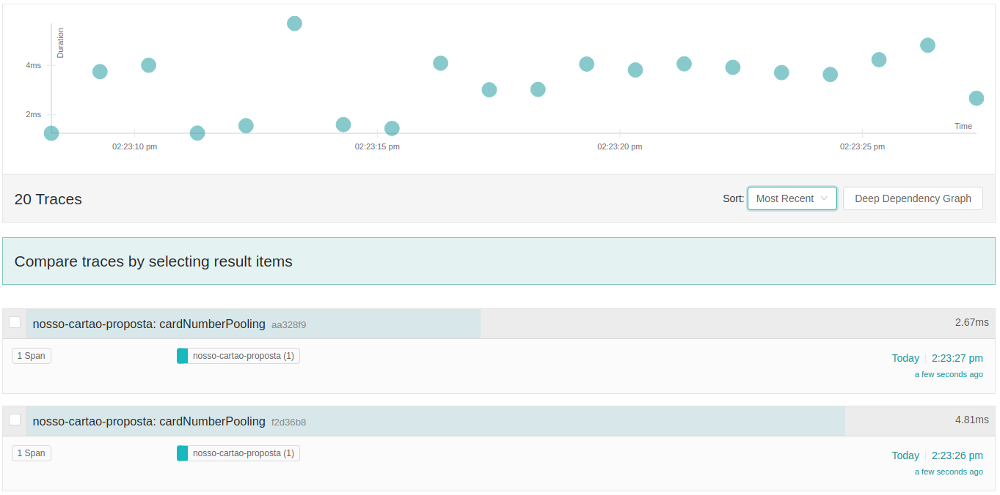

# Jaeger

O [Jaeger](https://www.jaegertracing.io/) é uma implementação bastante famosa do OpenTracing, na qual é mantida pela [Cloud Native Computing Foundation](https://www.cncf.io/).

   * Está em dúvida sobre o que é OpenTracing? Não tem problema! [Aqui tem uma explicação do que entendemos que você deve considerar!](../informacao_procedural/open-tracing.md)
   
Agora que sabemos o que é OpenTracing e o Jaeger, vamos aprender como configurar o mesmo utilizando Spring?

Vamos começar?

1º Precisamos adicionar a seguinte dependência em seu arquivo `pom.xml`:

```xml
<dependencies>
	<dependency>
      <groupId>io.opentracing.contrib</groupId>
      <artifactId>opentracing-spring-jaeger-web-starter</artifactId>
      <version>3.1.2</version>
    </dependency>
    
    <dependency>
      <groupId>io.opentracing.contrib</groupId>
      <artifactId>opentracing-spring-cloud-starter</artifactId>
      <version>0.5.6</version>
    </dependency>
</dependencies>
```

2º Precisamos configurar as propriedades do Jaeger no arquivo `application.properties`:

```properties
# Jaeger - Habilita ou não
opentracing.jaeger.enabled=${JAEGER_ENABLED:true}

# Jaeger - Nome do serviço
opentracing.jaeger.service-name=${spring.application.name}

# Jaeger - Endereço para enviar os metadados (trace, span, etc)
opentracing.jaeger.http-sender.url=${JAEGER_ENDPOINT:http://localhost:14268/api/traces}

# Jaeger - Tipo de amostragem (probabilístico) e sua configuração (1 = 100%)
opentracing.jaeger.probabilistic-sampler.sampling-rate=${JAEGER_SAMPLER:1}
```

Está tudo configurado, agora o spring faz sua mágica, pois ele tem inúmeras configurações automáticas para vários módulos, 
como por exemplo:

- Spring Web (RestControllers, RestTemplates, WebAsyncTask, WebClient, WebFlux)
- @Async, @Scheduled, Executors
- WebSocket STOMP
- Feign, HystrixFeign
- Hystrix
- JMS
- JDBC
- Kafka
- Mongo
- Zuul
- Reactor
- RxJava
- Redis
- Standard logging - logs are added to active span
- Spring Messaging - trace messages being sent through Messaging Channels
- RabbitMQ

Demais né! Vamos testar?

Para testar precisamos verificar se o Jaeger foi iniciado, conforme está no docker-compose, para isto, vamos abrir em 
nosso navegador favorito o endereço `http://localhost:16686/search`

Agora precisamos iniciar nossa aplicação e fazer algumas operações, como por exemplo, criar uma proposta!

Após fazer vários operações o nome do serviço deve aparecer no Jaeger, conforme imagem abaixo:



Selecione o nome do serviço e clique em `Find Traces`, logo após irá listar os traces do lado direito, conforme imagem 
abaixo:



Demais né!?

# Dicas de Luram Archanjo

Explore a ferramenta ao máximo, assim você conseguirá no futuro utilizar a mesma da melhorar maneira, como por exemplo:

- Filtrar por erro, tags, operação, duração, etc.
- Analisar os spans, como tempo, latência de redes, tags, logs, etc.
- Analisar as integrações.

# Informações de suporte

Gostaria de saber mais sobre a Jaeger? [Aqui tem uma explicação do que entendemos que você deve considerar!](https://www.jaegertracing.io/docs/1.18/#about)